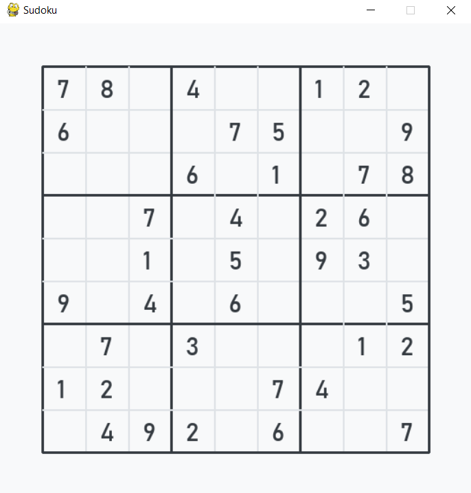
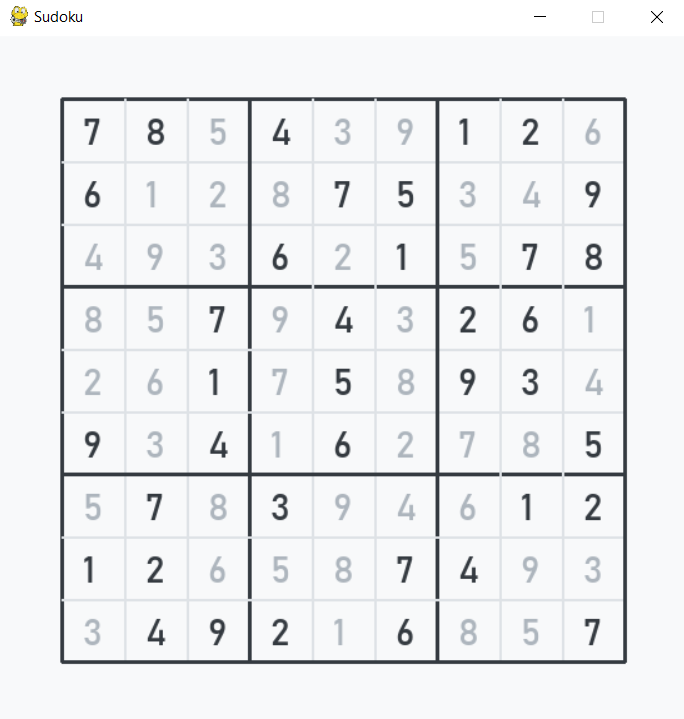

# Sudoku Solver

<p align="center">
  
</p>

## Solving Sudoku can be frustating :persevere:
## Unless you have a script that can solve it for you :smile:

  https://user-images.githubusercontent.com/90572543/186939484-83311c05-03c8-4bae-9e95-2fd57caf64a8.mp4

## Introduction

The popular Japanese puzzle game Sudoku is based on the logical placement of numbers. A game of logic, Sudoku doesn’t require any calculation nor special math skills; all that is needed are brains and concentration. Sudoku is one of the most popular puzzle games of all time. The goal of Sudoku is to fill a 9×9 grid with numbers so that each row, column and 3×3 section contain all of the digits between 1 and 9. As a logic puzzle, Sudoku is also an excellent brain game.

## Rules

The goal of Sudoku is to fill in a 9×9 grid with digits so that each column, row, and 3×3 section contain the numbers between 1 to 9. At the beginning of the game, the 9×9 grid will have some of the squares filled in. Your job is to use logic to fill in the missing digits and complete the grid. Don’t forget, a move is incorrect if:
- Any row contains more than one of the same number from 1 to 9
- Any column contains more than one of the same number from 1 to 9
- Any 3×3 grid contains more than one of the same number from 1 to 9

## Overview

Ever stuck while solving Sudoku puzzles given in newspapers, magazines, online etc. then this project helps you solve any Sudoku puzzle by using recursion and backtracking algorithm implemented by using Python and visualization. Recursion occurs when a function calls itself and backtracking is a kind of brute-force approach which comes into picture when solving a problem requires considering multiple choices as we don't know which choice is correct and we try to solve the problem using trail and error method considering one choice at a time until required answer is obtained.

## Methodology

This script visits all the empty cells in some order,filling the digits incrementally, backtracks when a number is not found to be valid. The program starts by filling '1' in the first cell if there are no violations, then advances to the second cell and places '1' incase violation occurs then increments and places '2'. It checks incrementally in this way and when none of the '1' to '9' numbers fit in this cell then the algorithm leaves the cell blank and goes back to the previous cell. The value in that cell is incremented and this process continues until all the cells are filled.

## Approach

  - We start by finding an unfilled cell(i,j).
  - If all the cells are filled then a valid sudoku is obtained.
  - We try to place every number between 1 to 9 in the unfilled cell.
  - Before placing we check for the constraints by checking the current row,current column and current 3×3 submatrix.
  - If any of the any of the constraint becomes false we'll not place that number at (i,j).
  - If all the constraints are true then we'll place that number at (i,j) and then repeat the process by finding an unfilled cell.
  - If at any point none of the numbers can be placed at (i,j) then we've to backtrack and change the values for already visited cells

## Controls

|   Key        |   Action                          |
| :----------- | :-------------------------------- |
|   `space`    |   Solves Sudoku by visualizing    |
|     `q`      |   Quits Sudoku GUI                |

## Requirements 

- Install latest version of **Python** from here: <a href="https://www.python.org/downloads/" target="_blank">Download</a> 	

- Install **Pygame** library by using following command:

  ```bash
    pip install pygame
  ```
  
## Deployment
  
- Clone this repository using

  ```bash
    git clone https://github.com/FrankoTheFreak/Sudoku-Solver.git
  ```
  
  **OR** 

- Zip **download** the repository and **extract** it's contents.

## Execution

- Run this command in your terminal

  ```bash
    python sudokusolver.py
  ```
  
## Results

- **Initial state**

<p align="center">
  
</p>

- **Final state**

<p align="center">
  
</p>

## Conclusion

This script is able to solve Sudoku puzzle successfully by using recursion and backtracking algorithm.

### Thanks For Visiting My Repo :blush:
#### Regards Sagar Mane :heart:
